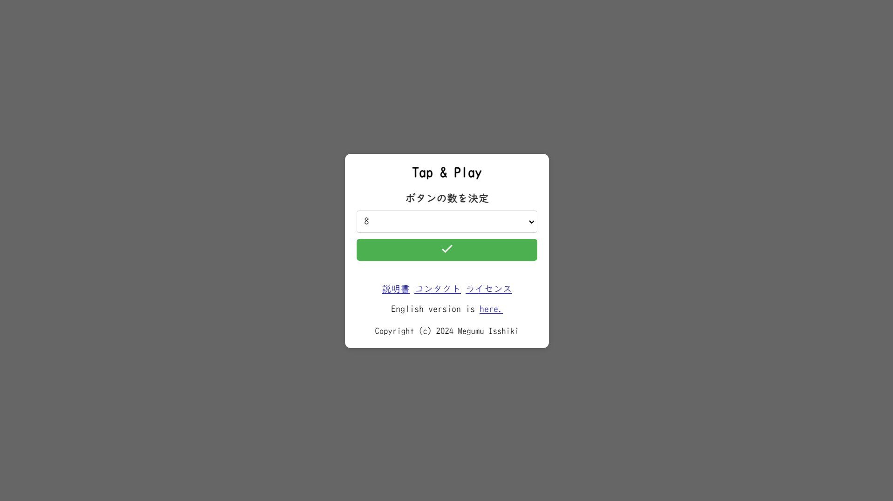

# Tap & Play

English version is [here](https://github.com/Davinci-Meg/sound_button/blob/main/README.md).

サイトへのアクセスは[こちら](https://davinci-meg.github.io/sound_button/)から

## 仕様

- 言語伝達が難しい場合を想定して作られたアプリケーションです。
- 画面全体をカバーするグリッド状にボタンが配置されています。
- 各ボタンの背景色、アイコン、音声はカスタマイズ可能です。
- ボタンをクリックすると特定の音声が再生されます。

## 利用方法

1. [サイト](https://davinci-meg.github.io/sound_button/)へアクセスする

2. ボタンの数を選択する(1~10個)
3. 目的に応じてボタンをカスタマイズする

## 使用技術

- HTML5
- CSS3
- JavaScript
- Google Material Icons

## カスタマイズ

- **Icons**: アイコンを変更するには、 `index.html` 内のボタン内の `span` 要素を修正します。.
- **Sounds**: `sounds` ディレクトリ内の音声ファイルを置き換え、 `index.html` 内の `onclick` 属性のパスを更新します。

## System Requirements

コンピュータでの使用を強くお勧めします。
- Google Chrome
- Safari

## License

このプロジェクトはMITライセンスの下でライセンスされています。詳細は　[LICENSE](LICENSE)　ファイルを参照してください。

## 謝辞

- このファイルは[英語版](https://github.com/Davinci-Meg/sound_button/blob/main/README.md)をChat-GPT 3.5によって翻訳したものです。
- [Google Material Icons](https://fonts.google.com/icons)

## 制作者

- [Megumu Isshiki](https://github.com/Davinci-Meg)
