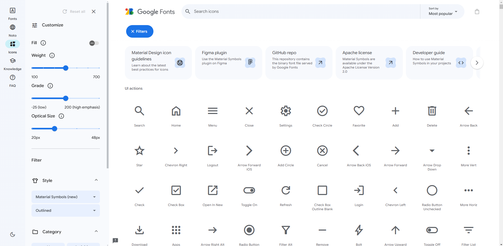
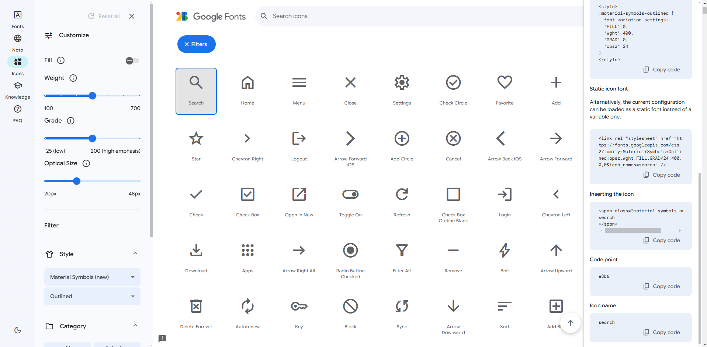
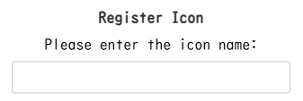
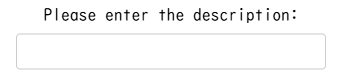

# Icon Registration Procedure

1. Select the icon you want to register from [Google Fonts Icons](https://fonts.google.com/icons).
   
   

2. After selection, copy the **Icon name** displayed in the sidebar.
   
   

3. Enter the copied **Icon name** into the text box.
   
   

4. Enter the word you want to set for the registered icon.
   
   

5. Finally, click the green **＋** button.
   
   
