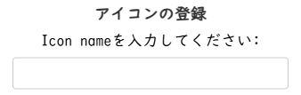
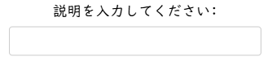

# アイコン登録手順

1. [Google Fonts Icons](https://fonts.google.com/icons)から登録したいアイコンを選択します。
   
   

2. 選択後、サイドバーに表示される**Icon name**をコピーします。
   
   

3. テキストボックスにコピーした**Icon name**を入力します。
   
   

4. 登録したいアイコンに設定したい単語を入力します。
   
   

5. 最後に緑色の**＋**ボタンをクリックします。
   
   
